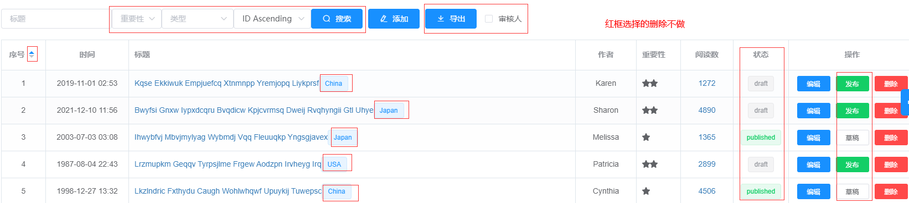

## 复习之前的知识 记好笔记
不懂的案例多做多问，笔记一定要记好

## 购物车作业
如图 
自己模拟 data 数据，就是购物车商品数组例如
```
  goods: [
    {
      id:1,
      goodsImg: '自己复制网络图片地址',
      goodsTitle: 'xxxxx',
      goodsPrice: 100,
      goodsCount: 2
    }
    后面自己加几条
  ]
```
功能要求
- 样式基本一致
- 展示购物车
- 购物车数量的加减 小计的计算 总价的计算
- 购物车商品选中状态的切换，全选的切换 （这个比较难）


## todo 待办事项
案例参考网址 https://todomvc.com/examples/vue/
默认待办事项数组可以写成空数组
功能要求
- 样式基本一致
- 添加，删除待办事项功能
- 修改待办事项状态， 修改待办事项内容(比较难)
- 切换待办事项类别(all  active  completed)


## 表格
图片参考 
书籍数据模拟
```
  [
    {
      id: 1,
      time: '2022-09-09',
      title: 'Kqse Ekkiwuk Empjuefcq Xtnmnpp Yremjopq Liykprsf',
      author: 'xxx',
      importance: 2,
      visitCount: 2000
    }
    自己多模拟几条
  ]
```

功能要求
- 展示书籍数据表格
- 新增 删除 编辑功能
- 搜索功能


## 提示
不懂就问，作业不是很简单，不一定所有的你都能实现，但是一定要慢慢研究做，能做多少做多少

没事看看面试题， 写写博客